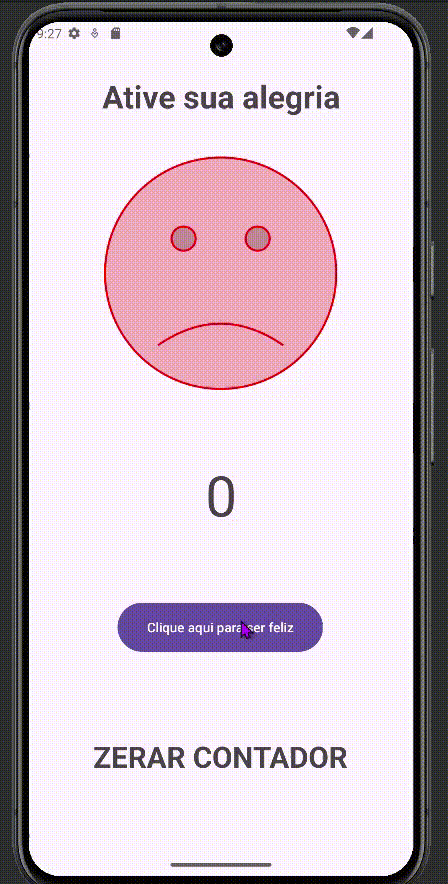

  

  <h5 align="center"> 
    <b>✅ Completo</b> | <b>✅ Responsivo</b>
  </h5>

<h1 align="center">
  
</h1>

**App Anti-Tristeza** é um aplicativo Android criado com o objetivo de trazer alegria e diversão aos usuários, através de interações simples que geram um sorriso ao longo do tempo. Ao clicar em um botão, o contador aumenta e o smiley muda, tornando o usuário cada vez mais feliz!

## Tecnologias Utilizadas

- **Linguagem**: Java (Android SDK)
- **Framework**: Android Jetpack (Activity, View, EdgeToEdge)
- **Interface Gráfica**: Widgets (TextView, ImageView, Button)
- **Versão Mínima do Android**: API 21 (Lollipop)

## Funcionalidades

- O app exibe um smiley que muda conforme o número de cliques.
- A cada clique, o contador é incrementado e o smiley passa por várias fases de felicidade.
- Ao atingir certos números de cliques, o smiley muda para uma versão mais alegre.
- Ao chegar em 100 cliques, o smiley atinge a felicidade plena!
- É possível resetar o contador e o smiley a qualquer momento.

## Como Funciona

1. **Iniciar o App**: O aplicativo começa com um smiley básico e o contador em zero.
2. **Clique para Alegria**: Ao clicar no botão "Clique Aqui", o contador é incrementado e o smiley muda conforme o número de cliques:
   - 10 cliques: Smiley mais feliz.
   - 20 cliques: Smiley ainda mais feliz.
   - 100 cliques: Smiley extremamente feliz!
3. **Resetar o App**: Ao clicar no botão de reset, o contador volta para zero e o smiley volta à sua forma original.

 ---
  

  
  ## 👩🏻‍💻 Autor  
  
  <table>
    <tr>
      <td align="center">
        <a href="https://github.com/robsonlmds">
           
          
            <b>Robson Lucas Messias</b>
          
        </a>
      </td>
    </tr>
  </table>
  
  

   
  <h4 align="center">
    Made by: Robson Lucas Messias | <a href="mailto:robsonlmds@hotmail.com">Contato</a>
  </h4>
  
  

    
  

  
  <h1 align="center">
  
  </h1>
